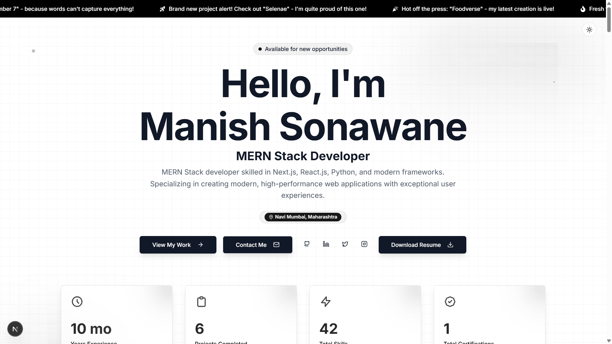

# Portfolio

**Portfolio** is a modern, responsive personal portfolio website designed to showcase projects, skills, and professional experience.  
It provides an elegant interface for highlighting achievements and a smooth user experience across devices.  

The project is built using **Next.js (App Router)**, **Tailwind CSS**, **Redux**, and **MongoDB**, ensuring a dynamic, scalable, and maintainable application with real-time data management.

---

### Copyright Notice
**Portfolio**

Copyright © 2024 Manish Sonawane. All rights reserved.

This project, **Portfolio**, is a demonstration of a personal portfolio website. Unauthorized use, modification, or distribution of the software or its components is prohibited unless explicitly stated under the terms of the license.

By using or contributing to this project, you agree to comply with the terms and conditions defined in the license. You may use the software for personal or educational purposes, provided that proper credit is given to the original author.

---

### License Information
This project is licensed under the MIT License. Please refer to the `LICENSE` file in this repository for detailed license information. The terms of the license govern the use, distribution, and modification of the software. If you have any questions regarding the licensing, please contact **manishsonawane3010@gmail.com**.

---

### Disclaimer
The software is provided "as-is" without warranty of any kind, express or implied, including but not limited to the warranties of merchantability, fitness for a particular purpose, and non-infringement. In no event shall the authors or copyright holders be liable for any claim, damages, or other liability, whether in an action of contract, tort, or otherwise, arising from, out of, or in connection with the software or the use or other dealings in the software.

---

### Trademarks
Any trademarks, service marks, or other marks associated with this project or its components are the property of their respective owners.
